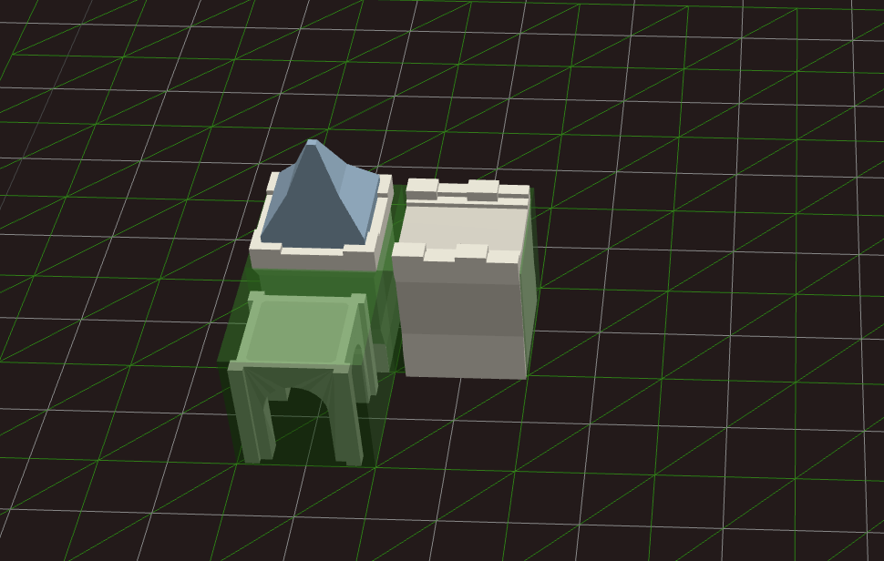
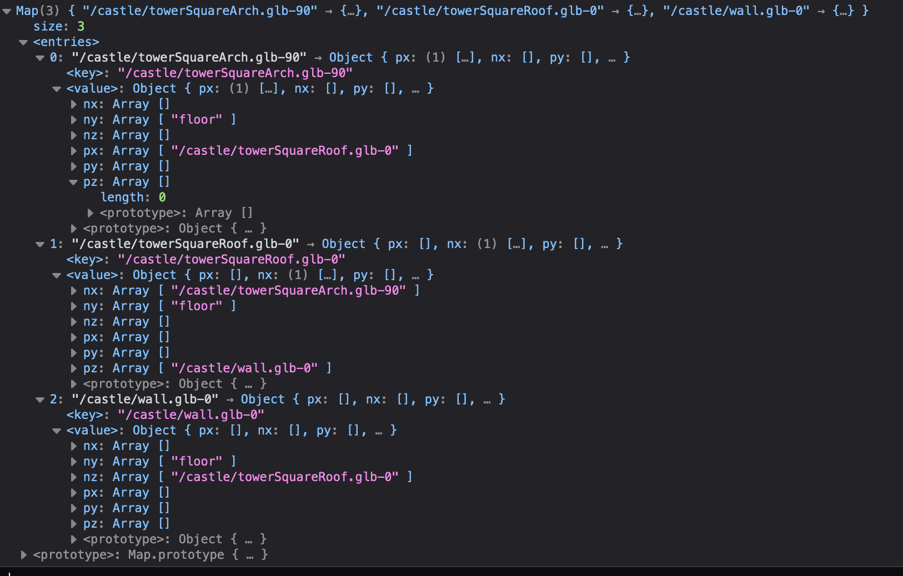

# Wave Collapse Algorithm Editor

An attempt at a Wave Collapse Function  + editor for manual edge to edge connection mapping.

What is a Wave Collapse Function ? 

Inspired by mxgmx original wave function collapse algorithm for bitmap random generation, where given a sample image , a randomly generated image that loosely resembles the source image is generated

<a href="https://github.com/mxgmn/WaveFunctionCollapse">Wave Function Collapse</a>

This example 

The function behaves as follows. 

At the start of the algorithm, we have a n x n x n  matrix of nodes. Each node at the begining exists in a superposition state , where every node has the possibility of any model or tile possible.
The algorithm performs the following:

- Get the node of lowest entropy ( node that has the least possibile number of choices )
- Collapse the newly selected node to a randomly chosen value
- Propagate the change to neighboring node

proceed until no under possibe choices are to be made or all nodes have been collapsed to one single choice.

Each Model in the list of supperposition model has 6 borders , that define which models are allowed to border said models. For Example :

Here we have 3 Models :

  Wall_With_roof.gtlf
  Wall.gtlf
  arch.gtlf

the borders would be defined as follows :
  

With special border set for the floor.

.

The editor was created for a simple way of deciding which models would border which other models. The editior allows for stacking of models , as well as rotation of models, which are stored accordingly in the connections map.

<h1>Tech Stack</h1>
<ul>
  <li>React Three Fiber</li>
  <li>react-three/rapier</li>
  <li>Zustand</li>
  <li>react-three/drei</li>
  <li>react</li>
</ul>  
